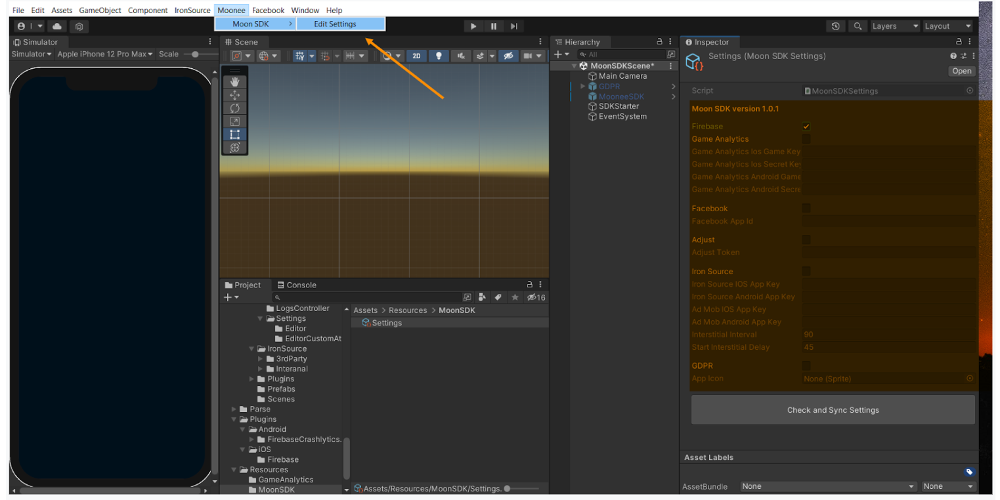

&nbsp;&nbsp;&nbsp;&nbsp;&nbsp;&nbsp;&nbsp;&nbsp;&nbsp;&nbsp;&nbsp;&nbsp;&nbsp;&nbsp;&nbsp;&nbsp;&nbsp;&nbsp;&nbsp;&nbsp;&nbsp;&nbsp;&nbsp;&nbsp;&nbsp;&nbsp;&nbsp;&nbsp;&nbsp;&nbsp;&nbsp;&nbsp;&nbsp;&nbsp;&nbsp;&nbsp;&nbsp;&nbsp;&nbsp;&nbsp;&nbsp;&nbsp;&nbsp;&nbsp;&nbsp;&nbsp;&nbsp;&nbsp;&nbsp;&nbsp;&nbsp;&nbsp;&nbsp;&nbsp;&nbsp;&nbsp;&nbsp;&nbsp;&nbsp;&nbsp;&nbsp;&nbsp;&nbsp;&nbsp;&nbsp;&nbsp;&nbsp;&nbsp;&nbsp;&nbsp;&nbsp;&nbsp;&nbsp;&nbsp;&nbsp;&nbsp;&nbsp;&nbsp;&nbsp;&nbsp;&nbsp;&nbsp;&nbsp;&nbsp;&nbsp;&nbsp;&nbsp;&nbsp;&nbsp;&nbsp;&nbsp;&nbsp;&nbsp;&nbsp;&nbsp;&nbsp;&nbsp;&nbsp;&nbsp;&nbsp;&nbsp;&nbsp;&nbsp;&nbsp;&nbsp;&nbsp;&nbsp;&nbsp;&nbsp;&nbsp;&nbsp;&nbsp;&nbsp;&nbsp;&nbsp;&nbsp;&nbsp;&nbsp;&nbsp;&nbsp;&nbsp;&nbsp;&nbsp;&nbsp;&nbsp;&nbsp;&nbsp;&nbsp;&nbsp;&nbsp;&nbsp;&nbsp;&nbsp;&nbsp;&nbsp;&nbsp;&nbsp;&nbsp;&nbsp;&nbsp;&nbsp;&nbsp;&nbsp;&nbsp;&nbsp;&nbsp;&nbsp;&nbsp;&nbsp;&nbsp;&nbsp;&nbsp;&nbsp;&nbsp;&nbsp;&nbsp;&nbsp;&nbsp;&nbsp;&nbsp;&nbsp;&nbsp;&nbsp;&nbsp;&nbsp;&nbsp;&nbsp;&nbsp;&nbsp;&nbsp;&nbsp;&nbsp;&nbsp;&nbsp;&nbsp;&nbsp;&nbsp;&nbsp;&nbsp;&nbsp;&nbsp;&nbsp;&nbsp;&nbsp;&nbsp;&nbsp;&nbsp;&nbsp;&nbsp;&nbsp;&nbsp;&nbsp;&nbsp;&nbsp;&nbsp;&nbsp;&nbsp;&nbsp;&nbsp; 

# Monetization Guide
Welcome, developers, to the full version of the Moon SDK! 🌕

Exciting news awaits as we transition to the Moonee SDK. If you were using the Moonlight SDK previously, kindly remove it and make the switch to this upgraded version.

In this journey, we're implementing MAX as the central mediator for all monetization partners, streamlining the process while also empowering you to leverage your own monetization products.

Let's embark on this enhanced development experience together! 🚀

#
#### Current Version: 1.3.5 (Released: 15/02/2024)

In this version, we've made the following updates:

- Updated Adapters: We've updated all adapters to ensure seamless integration with our monetization partners, enhancing performance and reliability.

- CMP for EU Consent: In compliance with EU regulations, we've implemented a Consent Management Platform (CMP) by Moonee to handle user consent for data processing. This addition ensures adherence to privacy standards while maintaining a user-centric approach.

#

  
Table of Contents

  
  1. [System Requirements](#system-requirements)
  2. [Downloading MOON SDK](#downloading-moon-sdk)
  3. [Setting Up Moon SDK](#setting-up-moon-sdk)
  4. [Initialization](#initialization)
  5. [Displaying Ads](#displaying-ads)  
      A. [Rewarded Video Ads](#rewarded-video-ads-api)  
      B. [Interstitial Ads](#interstitial-ads-api)  
      C. [Banner Ads](#banner-ads-api)
  6. [Events](#events)  
      A. [Analytic Events](#analytic-events)  
      B. [Adjust UA Events](adjust-ua-events)  
      C. [In-app purchase (IAP) Events](#in-app-purchase-iap-events)  
      D. [Progression events](#progression-events)  
  7.  [Firebase Configuration](#firebase-configuration)
  8.  [CMP - GDPR Consent](#cmp---gdpr-consent)
  9. [In-Game Fonts](#in-game-fonts)
  10. [Rate Us View](#rate-us-view)
  11. [Platform Configuration - If Not Yet Added](#platform-configuration---if-not-yet-added)  
    A. [Facebook](#facebook)  
    B. [Game Analytics](#game-analytics)
  12. [Testing](#testing)

## System Requirements

  

  
  - Unity Editor 2021.2 or higher (2021 LTS version)
  - Android:
    - Minimum SDK: Lollipop 5.0 (API 22)
    - Scripting backend: IL2CPP
  - iOS:
    - Target minimum iOS Version: 13.0
    - Scripting backend: IL2CPP
  - Stores:
    - In order for us to have the optimal monetization, we will need you to add our web link in the stores:[https://moonee.io](#https://moonee.io)
    - On Google play it’s under Store Settings -> Website
    - On App Store it’s under Marketing URL in an App Version

      

## Downloading MOON SDK

  

  The current version of the MOON SDK is version 1.3.5    (Slack bot is sending the link) 
  

  

## Setting Up Moon SDK

  

  1. Import MoonSDK.unitypackage into your unity project.
  
  2. Please note, that our SDK uses some iAP features, so iAP package should be installed from the package manager
  
  3. The MoonSDKScene must be the first in the list in the build settings, after initialization it will load the next scene in the list (with index 1).

     
     
  4. Open MoonSDK settings and fill in all app keys for analytics and advertising services which you want to use and press Check and Sync Settings button
    
     

 
## Initialization

  

Moon SDK is initialized automatically from the Moon SDK scene.

## Displaying Ads

  

MoonSDK does support the following ad formats:

A. [Rewarded Video Ads](#rewarded-video-ads-api)  
B. [Interstitial Ads](#interstitial-ads-api)  
C. [Banner Ads](#banner-ads-api)

To use the advertisement manager add the following namespace: 
      using `Moonee.MoonSDK.Internal.Advertisement;`

  ### Rewarded video ads API:

  
Expand

  
       void AdvertisementManager.ShowRewardedAd
       (
         [Action OnStartAdEvent = null],
         [Action OnFinishAdEvent = null],
         [Action OnFailAdEvent = null],
         [Action OnFinishRewardedVideowWithSuccessEvent = null]
       )
       
       AdvertisementManager.ShowRewardedAd(
        () => 
        {
            //Ad start logic
        },
        () =>
        {
            //Add finish logic
        },
        () =>
        {
            //Ad fail logic
        },
        () =>
        {
            //Add Reward logic
        });
      
      Bool AdvertisementManager.IsRewardedAdReady()
      AdvertisementManager.IsRewardedAdReady();

  ### Interstitial ads API:

  
Expand

      float AdvertisementManager.InterstitialTimer {get; private set;}
      double timeLeftForNextAd = AdvertisementManager.InterstitialTimer;

      void AdvertisementManager.ShowInterstitial
       (
         [Action OnStartAdEvent = null],
         [Action OnFinishAdEvent = null],
         [Action OnFailAdEvent = null]
       )
       
       AdvertisementManager.ShowInterstitial(
        () =>
        {
            //Ad start logic
        },
        () =>
        {
            //Add finish logic
        },
        () =>
        {
            //Ad fail logic
        });

        Bool AdvertisementManager.IsInterstitialdAdReady()
        AdvertisementManager.IsInterstitialdAdReady();

  ### Banner Ads API:

  
Expand

      void AdvertisementManager.ShowBanner()
      AdvertisementManager.ShowBanner();

      AdvertisementManager.HideBanner();
      void AdvertisementManager.HideBanner();
      

## Events

  

  
A. [Analytic Events](#analytic-events)  
B. [Adjust UA Events](adjust-ua-events)  
C. [In-app purchase (IAP) Events](#in-app-purchase-iap-events)  
D. [Progression events](#progression-events)  
  
### Analytic Events

  

With Moon SDK you can send custom events to various analytics services
  
       Void  MoonSDK.TrackCustomEvent("Event name", [Dictionary <string, object> eventProperties = null],
      [string type = null],
      [List < MoonSDK.AnalyticsProvider> analyticsProviders = null])
      
Call this method to track any custom event you want.  
eventName = the name of the event to track.  
Exsample:  
      
      MoonSDK.TrackCustomEvent("Event name", MoonSDK.AnalyticsProvider.Firebase);
  

### Adjust UA Events

  

  
     void MoonSDK.sendUAEvent(UAEventType.eventType);
     MoonSDK.SendUAEvent(MoonSDK.UAEventType.Type1);
     

### In-app purchase (IAP) Events:

  

  
To accurately monitor in-app purchase (IAP) revenue through Adjust, ensure you've configured the Adjust app token and the IAP revenue event token within the Moon SDK settings.
Go to receipt Validation Obfuscator , paste the google public key of your app and press “Obfuscate Google Play License Key”.
Please ensure that the event is triggered from every available location where the product can be purchased. If users have the option to buy from both the in-game store and a popup, make sure the event is sent in both scenarios

After each successful purchase you need to send event to adjust:

Price in USD use this method
   
    void MoonSDK.TrackAdjustRevenueEvent(PurchaseEventArgs e, double priceInUSD)

To send price in local currency use this method

    void MoonSDK.TrackAdjustRevenueEvent(PurchaseEventArgs e, double product)

    MoonSDK.TrackAdjustRevenueEvent(20, transactionID);

How to get parameters for these methods?  

     PurchaseProcessingResult method

### Progression Events

  

  
**Levels progression events using Adjust and Moonee's Developer's Dahboard:**  

      MoonSDK.SendLevelDataStartEvent((GameModel.levelIndex + 1).ToString());
      MoonSDK.SendLevelDataCompleteEvent(LevelStatus.complete, (GameModel.levelIndex + 1).ToString(), LevelResult.win, isContinueLevel);
      
**Levels progression events using GameAnalytics:**  

      void MoonSDK.TrackLevelEvents(MoonSDK.LevelEvents eventType, int levelIndex);
      MoonSDK.TrackLevelEvents(MoonSDK.LevelEvents.Start, 1);

**Note**: In this part it is crutial to check:  
     - **A.** Token to Adjust for EACH event  
     - **B.**  No spaces before and after the token 

## Firebase Configuration

  

To correctly initialize Firebase, you need to go to the Firebase console and download the configuration files to your project (google-services.json for android and GoogleService-Info.plist for iOS)
  

**Firebase Remote Config** 

Moon SDK by default uses some default remote config values:

1. int_grace_time: Interstitials Grace Time - time (in seconds) from app first use until first INT.
2. Int_grace_level: Interstitials Grace Level-  after which level first INT will be shown.
3. cooldown_between_INTs: Cooldown Between Interstitials -  timer (in seconds) for spaces between INTs.
4. cooldown_after_RVs: Cooldown After Rewarded Videos- time (in seconds) for INT AFTER watching a Rewarded video.( Replace cooldown_between_int ).
5. Show_int_if_fail: Show Interstitial If Fail 	
True: player gets ads after each level, regardless of success status,
False:  player gets ads after success levels only.
6. INT_in_stage: Interstitials In Stage,
True: player gets ads during stages
False: player gets ads after stages only
**Default values:**
int_grace_time: 30 sec
Int_grace_level: 1 level
cooldown_between_INTs: 20 sec
cooldown_after_RVs: 20 sec
Show_int_if_fail: False
INT_in_stage: False

Note that int_grace_time, cooldown_between_INTs, cooldown_after_RVs are managed automatically by Moon SDK and you don’t need to do anything with that, but the rest values you need to check before showing ads.

       if(currentLevel > RemoteConfigValues.int_grace_level)
        {
            AdvertisementManager.ShowInterstitial();
        }

      if(RemoteConfigValues.Show_int_if_fail == true)
        {
            AdvertisementManager.ShowInterstitial();
        }

      if(RemoteConfigValues.INT_in_stage == true)
        {
            AdvertisementManager.ShowInterstitial();
        }

## CMP - GDPR Consent

  

We utilize a CMP (Consent Management Platform) solution to obtain consent from users.   
Effective CMP implementations can potentially boost the value of users engaging with the game, potentially adding up to 50% of the ad's worth.
  
To use CMP in your project you need to fill in the Adjust Consent Token:  
    
  
Below you will find a code example how to pop up the consent window from your game,you will need to mute sounds and stop any ad timers.   
Create a consent button in settings screen in your game.

      private void ConsentsButtonPressed()
    {
        CMP.OpenSettingsScreen();
        CMP.eventHandler += OnConsentsChangesEventListener; // Don't forget to unsubscribe, you can use OnDestroy method for example
        // AdvertisementManager.PauseInterstitialTimer();
        // AudioController.PauseMusic(true);
    }
    private void OnConsentsChangesEventListener(int id, TCData TCData, bool isSuccess)
    {
        //AdvertisementManager.ResumeInterstitialTimer();
        //AudioController.PauseMusic(false);
    }

Check if the user is in the GDPR country

    if(!CheckGDPRCountry.CheckCountryForGDPR())
        {
    //Disable cmp pop-up
        } 

Add this on the CMP.cs script:

     private void Start()
        {
            privacySettingsView = Resources.Load<PrivacySettingsView>("PrivacySettingsView");
            GDPRView = Resources.Load<GDPRView>("GDPRView") as GDPRView;
            staticSDKStarter = SDKStarter;

            if (TCData.IsAlreadyAsked)
            {
                SDKStarter.enabled = true;
      //added this line
                regionIdentifier.SetCurrentRegion(() => { });
            }
            else
            {
                regionIdentifier.SetCurrentRegion(() => 
                {
                    if(CheckGDPRCountry.CheckCountryForGDPR())
                    {
                        Instantiate(GDPRView);
                    }
                    else
                    {
                        SDKStarter.enabled = true;
                    }
                });
            }
        }
        

  

## In-Game Fonts

  

  
In terms of in-game fonts, they must be official fonts from Google Fonts or Liberation Sans from Unity. Follow these steps to ensure compliance with font licensing:

1. Use only fonts from the Google Fonts library or Liberation Sans from Unity.
2. After selecting the relevant font, ensure you have the license for the game code as a text file.
3. Rename the license file to the following format: `Fontname_license.txt`.
4. Place both the font file and its license file in the Fonts directory of your project.
5. The most common font licenses are OFL (Open Font License) and Apache License.
6. Copy everything in the StreamingAssets directory to add a new licensed font, which will be automatically added to the build.
7. Fonts from Google Fonts can be used for both Android and iOS games. You can find them at [Google Fonts](https://fonts.google.com/).
8. Unity typically has two built-in fonts:
   * Liberation Sans (free to use)
   * Arial (note: Arial is not free to use)
9. Refer to the following guides for embedding custom fonts in games:
   * Unity - Manual: [Font Assets](https://docs.unity3d.com/Manual/class-Font.html).

By adhering to these guidelines, you ensure that your game uses licensed fonts responsibly and legally.

## Rate Us View

  

  
You can open rate us screen using code example below

     MoonSDK.OpenRateUsScreen();
     

 ## Platform Configuration - If Not Yet Added
 
 

  

   
A. [Facebook](#facebook)  
B. [Game Analytics](#game-analytics)

### Facebook
 

  

#### 1: Creating a game in the [Facebook UI](https://developers.facebook.com/apps)

#### 2: Create an app

The following manual by Meta explains how to create an app: [Manual](https://developers.facebook.com/docs/development/create-an-app/)

When you need to choose the type of the app, choose "Other" > "Gaming app".

#### 3: Go to Settings > Basic and fill the needed info

#### 4: Create a valid privacy policy and User data deletion

  A. Create Privacy policy on: [this link](https://app-privacy-policy-generator.firebaseapp.com/)  
  B. After creating, download it and open it on Google Docs.  
  C. Under "File" choose "Publish to the web" and it will create you a Privacy Policy link.  
  D. Insert the created link on Both privacy policy and User data deletion sections, and choose the needed Category and Sub-Category (Hyper Casual, Hybrid etc.).

#### 5: Choose and add your platform

  A. Android: fill the package name (it’s the bundle), and on iOS fill App’s ID and Bundle ID.  
  B. Other sections or to confirm ownership are not mandatory so don’t worry about it!  
  C. Click “Save Changes”.
  

#### 6: Activate your app

Make sure to set the status on the first row to "Live".

#### 7: Add Moonee’s Ad Account ID

For us to be able to test your game, we need to connect it to our Ad Account:  
  a. Go to Settings -> Advanced and fill the needed info:  
  b. Scroll down to the section “Advertising Accounts” and insert Moonee’s Ad Account ID:`267507499172466`.

#### 8: Verify data

You can download + open the app and check on FB Developer main dashboard if you’re seeing data of last date installs.

#### 9: Share in the Slack channel your FB App ID.

  
  

### Game Analytics
 

  

1. Create a Game analytics account and asset using this [link](https://tool.gameanalytics.com/login?redirect=%252F).
2. If your game is level-based, make sure to have the events:
   - Start
   - Complete
   - Fail
3. Make sure to have the level events naming in the format:
   - “Level0001”
   - “Level0002”
   (Make sure to start from level 0001 and not from 0000)
4. Grant us Admin access to the app on Game Analytics: 
   - Settings -> Users -> Invite users -> for this user erez@moonee.io
  

 

## Testing

  

Get check for the following:
  - We get the following events:
    - levelDataStart
    - levelDataComplete events from the app
  - We get consent event

# Good Luck! 

