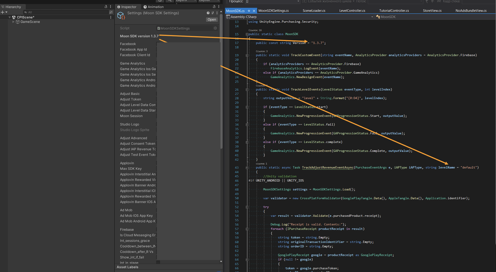

&nbsp;&nbsp;&nbsp;&nbsp;&nbsp;&nbsp;&nbsp;&nbsp;&nbsp;&nbsp;&nbsp;&nbsp;&nbsp;&nbsp;&nbsp;&nbsp;&nbsp;&nbsp;&nbsp;&nbsp;&nbsp;&nbsp;&nbsp;&nbsp;&nbsp;&nbsp;&nbsp;&nbsp;&nbsp;&nbsp;&nbsp;&nbsp;&nbsp;&nbsp;&nbsp;&nbsp;&nbsp;&nbsp;&nbsp;&nbsp;&nbsp;&nbsp;&nbsp;&nbsp;&nbsp;&nbsp;&nbsp;&nbsp;&nbsp;&nbsp;&nbsp;&nbsp;&nbsp;&nbsp;&nbsp;&nbsp;&nbsp;&nbsp;&nbsp;&nbsp;&nbsp;&nbsp;&nbsp;&nbsp;&nbsp;&nbsp;&nbsp;&nbsp;&nbsp;&nbsp;&nbsp;&nbsp;&nbsp;&nbsp;&nbsp;&nbsp;&nbsp;&nbsp;&nbsp;&nbsp;&nbsp;&nbsp;&nbsp;&nbsp;&nbsp;&nbsp;&nbsp;&nbsp;&nbsp;&nbsp;&nbsp;&nbsp;&nbsp;&nbsp;&nbsp;&nbsp;&nbsp;&nbsp;&nbsp;&nbsp;&nbsp;&nbsp;&nbsp;&nbsp;&nbsp;&nbsp;&nbsp;&nbsp;&nbsp;&nbsp;&nbsp;&nbsp;&nbsp;&nbsp;&nbsp;&nbsp;&nbsp;&nbsp;&nbsp;&nbsp;&nbsp;&nbsp;&nbsp;&nbsp;&nbsp;&nbsp;&nbsp;&nbsp;&nbsp;&nbsp;&nbsp;&nbsp;&nbsp;&nbsp;&nbsp;&nbsp;&nbsp;&nbsp;&nbsp;&nbsp;&nbsp;&nbsp;&nbsp;&nbsp;&nbsp;&nbsp;&nbsp;&nbsp;&nbsp;&nbsp;&nbsp;&nbsp;&nbsp;&nbsp;&nbsp;&nbsp;&nbsp;&nbsp;&nbsp;&nbsp;&nbsp;&nbsp;&nbsp;&nbsp;&nbsp;&nbsp;&nbsp;&nbsp;&nbsp;&nbsp;&nbsp;&nbsp;&nbsp;&nbsp;&nbsp;&nbsp;&nbsp;&nbsp;&nbsp;&nbsp;&nbsp;&nbsp;&nbsp;&nbsp;&nbsp;&nbsp;&nbsp;&nbsp;&nbsp;&nbsp;&nbsp;&nbsp;&nbsp;&nbsp;&nbsp;&nbsp;&nbsp;&nbsp;&nbsp; 

# Monetization Guide
Welcome, developers, to the full version of the Moon SDK! 🌕

Exciting news awaits as we transition to the Moonee SDK. If you were using the Moonlight SDK previously, kindly remove it and make the switch to this upgraded version.

In this journey, we're implementing MAX as the central mediator for all monetization partners, streamlining the process while also empowering you to leverage your own monetization products.

Let's embark on this enhanced development experience together! 🚀

#
#### Current Version: 1.3.9 (Released: 11/07/2024)

In this version, we've made the following updates:

- Send moves per level
- Update adaptors (Including Facebook)
- IAP catalog
- Sending level events with one function to Adjust and Game Analytics 

Note: The inspector is asking you for a sesson toke, please leave it empty for now.

# Table of Contents

  

1. [System Requirements](#system-requirements)
2. [Downloading MOON SDK](#downloading-moon-sdk)
3. [Setting Up Moon SDK](#setting-up-moon-sdk)
4. [Initialization](#initialization)
5. [Displaying Ads](#displaying-ads)  
   A. [Rewarded Video Ads](#rewarded-video-ads-api)  
   B. [Interstitial Ads](#interstitial-ads-api)  
   C. [Banner Ads](#banner-ads-api)
6. [Events](#events)  
   A. [Analytic Events](#analytic-events)  
   B. [In-app purchase (IAP) Events](#in-app-purchase-iap-events)  
   C. [Progression events](#progression-events)
7. [Firebase Configuration](#firebase-configuration)
8. [CMP - GDPR Consent](#cmp---gdpr-consent)
9. [In-Game Fonts](#in-game-fonts)
10. [Rate Us View](#rate-us-view)
11. [Platform Configuration - If Not Yet Added](#platform-configuration---if-not-yet-added)  
    A. [Facebook](#facebook)  
    B. [Game Analytics](#game-analytics)
12. [DATA Safety](#data-safety)  
      A. [Android](#android)  
      B. [iOS](#ios)  
      C. [Facebbok Data Checkup](#facebbok-data-checkup)  
13. [Testing](#testing)
14. [Common Issues](#common-issues)

## System Requirements

  

  
  - Unity Editor 2022 or higher (2022 LTS version)
  - Android:
    - Minimum SDK: Lollipop 5.0 (API 22)
    - Scripting backend: IL2CPP
  - iOS:
    - Target minimum iOS Version: 13.0
    - Scripting backend: IL2CPP
  - Stores:
    - In order for us to have the optimal monetization, we will need you to add our web link in the stores:[https://moonee.io](#https://moonee.io)
    - On Google play it’s under Store Settings -> Website
    - On App Store it’s under Marketing URL in an App Version

      

## Downloading MOON SDK

  

  The current version of the MOON SDK is version 1.3.7   
  Slack bot is sending the link if you will type `FULL_SDK` 
  

  

## Setting Up Moon SDK

  

  1. Import MoonSDK.unitypackage into your unity project.
  
  2. Please note, that our SDK uses some iAP features, so iAP package should be installed from the package manager
  
  3. The MoonSDKScene must be the first in the list in the build settings, after initialization it will load the next scene in the list (with index 1).

     
     
  4. Open MoonSDK settings and fill in all app keys for analytics and advertising services, Please ensure you add **all** of them and **copy/paste** them to the correct location in the inspector.
  5. press Check and Sync Settings button  
     **Note:Make sure to copy/paste the tokens/ad IDs and not type them manually to avoid mistakes.**
    
     

     

 
## Initialization

  

Moon SDK is initialized automatically from the Moon SDK scene.

## Displaying Ads

  

MoonSDK does support the following ad formats:

A. [Rewarded Video Ads](#rewarded-video-ads-api)  
B. [Interstitial Ads](#interstitial-ads-api)  
C. [Banner Ads](#banner-ads-api)

To use the advertisement manager add the following namespace: 
      using `Moonee.MoonSDK.Internal.Advertisement;`

  ### Rewarded video ads API:

  
Expand

  Note a change: Add Rewarded video name 
  
       void AdvertisementManager.ShowRewardedAd
       (
         [Action OnStartAdEvent = null],
         [Action OnFinishAdEvent = null],
         [Action OnFailAdEvent = null],
         [Action OnFinishRewardedVideowWithSuccessEvent = null]
       )
       
       AdvertisementManager.ShowRewardedAd(
        () => 
        {
            //Ad start logic
        },
        () =>
        {
            //Add finish logic
        },
        () =>
        {
            //Ad fail logic
        },
        () =>
        {
            //Add Reward logic
        }, 
        "rewardedVideoName"); // Add Rewarded video name
      
      Bool AdvertisementManager.IsRewardedAdReady()
      AdvertisementManager.IsRewardedAdReady();

  ### Interstitial ads API:

  
Expand

      float AdvertisementManager.InterstitialTimer {get; private set;}
      double timeLeftForNextAd = AdvertisementManager.InterstitialTimer;

      void AdvertisementManager.ShowInterstitial
       (
         [Action OnStartAdEvent = null],
         [Action OnFinishAdEvent = null],
         [Action OnFailAdEvent = null]
       )
       
       AdvertisementManager.ShowInterstitial(
        () =>
        {
            //Ad start logic
        },
        () =>
        {
            //Add finish logic
        },
        () =>
        {
            //Ad fail logic
        });

        Bool AdvertisementManager.IsInterstitialdAdReady()
        AdvertisementManager.IsInterstitialdAdReady();

  ### Banner Ads API:

  
Expand

      AdvertisementManager.ShowBanner()
      
      AdvertisementManager.HideBanner();
      

## Events

  

  
A. [Progression events](#progression-events)  
B. [In-app purchase (IAP) Events](#in-app-purchase-iap-events)  
C. [Custom Events](#custom-events)   
  

### Progression Events

  

  
**Levels progression events sends events to Adjust and Game Analytics:**  
We utilize two key events related to game level progression: `LevelDataStartEvent` and `LevelDataCompleteEvent`.

`LevelDataStartEvent` is sent at the beginning of the level
1. `coinsAmount` - Indicates the main currency current amount (In level 1, if the users start with 0, send 0.)
2. `purchaseIDs` - Indicates which in-app purchases the user made before starting this level, since the last time this event was sent.

Use it as described below:

     MoonSDK.SendLevelDataStartEvent(levelIndex, coinsAmount, purchaseIDs);

`LevelDataCompleteEvent`  is sent at the end of the level:
1. `LevelStatus` - Indicates the current status of the level, which could be "start" when the level begins, "fail" if the player fails to complete it, or "complete" if the player finishes it without winning.
2. `levelIndex` - Indicates level index, Make sure to send it as `0001` and not in other formats `001` or `1`. Make sure to start from level `0001` and not from `0000`.
3. `LevelResult` - Represents the outcome of the level, which could be "win" if the player successfully completes it or "fail" if the player fails to complete it.
4. `isContinue` - A boolean argument that indicates whether the player is continuing the level from where they left off (true) or starting it from the beginning (false). This is particularly useful for long idle levels or when there's a revive   
     option. If the game doesn't have these features, it should be set to false by default.
5. `coinsAmount` - Shows the current amount of the main currency once the level is completed.
6. `movesAmount` - The number of moves the player made to complete the level.

Use it as described below:

     MoonSDK.SendLevelDataCompleteEvent(LevelStatus.complete, levelIndex, LevelResult.win, isContinue, coinsAmount, movesAmount);

For the in game store data, use the following (the rest is aoutomatic):

      MoonSDK.OpenInGameStore(); // Execute when user opens the store
      MoonSDK.CloseInGameStore(); // Execute when user closes the store

For the in game store data, use the following (the rest is aoutomatic):

      MoonSDK.OpenInGameStore(); // Execute when user opens the store
      MoonSDK.CloseInGameStore(); // Execute when user closes the store

**Note!** Rememeber to add every Rewarded Video you are using!   
Adding the folowing part `"rewardedVideoName");` at the end of the function mentioned [here](#rewarded-video-ads-api)
      
**Note**: In this part it is crutial to check:  
     - **A.** Token to Adjust for EACH event  
     - **B.**  No spaces before and after the token    
     - **C** Make sure to **copy/paste** the tokens!!!   
     

### In-app purchase (IAP) Events:

  

  
To accurately monitor in-app purchase (IAP) revenue through Adjust, ensure you've configured the Adjust app token and the IAP revenue event token within the Moon SDK settings.  
Go to receipt Validation Obfuscator , **paste** the google public key of your app and press **“Obfuscate Google Play License Key”**.  
Please ensure that the event is triggered from every available location where the product can be purchased. If users have the option to buy from both the in-game store and a popup, make sure the event is sent in both scenarios.  
If you don't have an in app in the game, send `string.Empty`

In-app purchase (IAP) Event contains the following parameters:
1. `iAPType` - Refer to the different types of in-app purchaseS:
    A. `product` - A one-time purchase.
    B. `Subscription` - A product that allows users to purchase content for a defined period. 
3. `levelNunmber` -  Specifies the level where the in-app purchase was made.

After each successful purchase you need to send event to adjust:

      public static async Task MoonSDK.TrackAdjustRevenueEventAsync(PurchaseEventArgs e, iAPType iAPType, string levelNumber = "default")
      await  MoonSDK.TrackAdjustRevenueEventAsync(product, iAPType.product, "0001");

Example:

      System.Threading.Tasks.Task task = MoonSDK.TrackAdjustRevenueEventAsync(args, subsription, $"{LevelNumber}");

### Custom Events

  

The following is only for advance games, that have a need for custom events:  
With Moon SDK you can send custom events to various analytics services
  
      MoonSDK.TrackCustomEvent("Event name", [Dictionary <string, object> eventProperties = null],
      [string type = null],
      [List < MoonSDK.AnalyticsProvider> analyticsProviders = null])
      
Call this method to track any custom event you want.  
eventName = the name of the event to track.  
Exsample:  
      
      MoonSDK.TrackCustomEvent("Event name", MoonSDK.AnalyticsProvider.Firebase);
  

## Firebase Configuration

  

**We utilize Firebase for two primary purposes:**

1. User Acquisition: To facilitate proper integration within Google platforms, event data needs to be stored in Firebase.
2. A/B Testing via Remote Config: This powerful tool enables remote modification of parameters.

**Workflow:**

1. A designated team member, typically the Product Manager, will initiate a Firebase project for your game (do not create one yourself, as it may lead to improper UA usage).
2. You will receive configuration files (google-services.json for Android and GoogleService-Info.plist for iOS).
3. Integrate these files into your Unity project following the instructions provided below.

  

**Firebase Remote Config** 

Moon SDK by default uses some default remote config values:
1. `int_sessions_grace`: Interstitials sessions grace - sessions grace untill interstitial.
2. `cooldown_between_INTs`: Cooldown Between Interstitials -  timer (in seconds) for spaces between INTs.
3. `cooldown_after_RVs`: Cooldown After Rewarded Videos- time (in seconds) for INT AFTER watching a Rewarded video.( Replace cooldown_between_int ).
4. `show_int_if_fail`: Show Interstitial If Fail 	
`True`: player gets ads after each level, regardless of success status,
`False`:  player gets ads after success levels only.
5. `int_in_stage`: Interstitials In Stage,
`True`: player gets ads during stages
`False`: player gets ads after stages only

**Default values:**
`int_sessions_grace`: 0 sec
`cooldown_between_INTs`: 20 sec
`cooldown_after_RVs`: 20 sec
`show_int_if_fail`: False
`int_in_stage`: False

Note that `int_sessions_grace`, `cooldown_between_INTs`, `cooldown_after_RVs` are managed automatically by Moon SDK and you don’t need to do anything with that, but the rest values you need to check before showing ads.

       if(currentLevel > RemoteConfigValues.int_grace_level)
        {
            AdvertisementManager.ShowInterstitial();
        }

      if(RemoteConfigValues.Show_int_if_fail == true)
        {
            AdvertisementManager.ShowInterstitial();
        }

      if(RemoteConfigValues.INT_in_stage == true)
        {
            AdvertisementManager.ShowInterstitial();
        }

## CMP - GDPR Consent

  

We utilize a CMP (Consent Management Platform) solution to obtain consent from users.   
Effective CMP implementations can potentially boost the value of users engaging with the game, potentially adding up to 50% of the ad's worth.
  
To use CMP in your project you need to fill in the Adjust Consent Token:  
    

Consent precedes any other aspect of the SDK and the tutorial. We are dedicated to compliance with the highest regulatory standards in Europe, as outlined by the GDPR enforced by the IAB. Therefore, we are unable to implement the best practice of obtaining consent after the tutorial.
The CMP popup appears as follows: 

 
ConsentPopUp

  
 

Below you will find a code example how to pop up the consent window from your game,you will need to mute sounds and stop any ad timers.   
Create a consent button in settings screen in your game.  

    

      private void ConsentsButtonPressed()
    {
        CMP.OpenSettingsScreen();
        CMP.eventHandler += OnConsentsChangesEventListener; // Don't forget to unsubscribe, you can use OnDestroy method for example
        // AdvertisementManager.PauseInterstitialTimer();
        // AudioController.PauseMusic(true);
    }
    private void OnConsentsChangesEventListener(int id, TCData TCData, bool isSuccess)
    {
        //AdvertisementManager.ResumeInterstitialTimer();
        //AudioController.PauseMusic(false);
    }

Check if the user is in the GDPR country

    if(!CheckGDPRCountry.CheckCountryForGDPR())
        {
    //Disable cmp pop-up
        } 

        

  

## In-Game Fonts

  

  
In terms of in-game fonts, they must be official fonts from Google Fonts or Liberation Sans from Unity. Follow these steps to ensure compliance with font licensing:

1. Use only fonts from the Google Fonts library or Liberation Sans from Unity.
2. After selecting the relevant font, ensure you have the license for the game code as a text file.
3. Rename the license file to the following format: `Fontname_license.txt`.
4. Place both the font file and its license file in the Fonts directory of your project.
5. The most common font licenses are OFL (Open Font License) and Apache License.
6. Copy everything in the StreamingAssets directory to add a new licensed font, which will be automatically added to the build.
7. Fonts from Google Fonts can be used for both Android and iOS games. You can find them at [Google Fonts](https://fonts.google.com/).
8. Unity typically has two built-in fonts:
   * Liberation Sans (free to use)
   * Arial (note: Arial is not free to use)
9. Refer to the following guides for embedding custom fonts in games:
   * Unity - Manual: [Font Assets](https://docs.unity3d.com/Manual/class-Font.html).

By adhering to these guidelines, you ensure that your game uses licensed fonts responsibly and legally.

## Rate Us View

  

  
You can open rate us screen using code example below

     MoonSDK.OpenRateUsScreen();

The SDK rate us logic is just a default one, You can overwrite it with your own UI and logic.
     

 ## Platform Configuration - If Not Yet Added
 
 

  

   
A. [Facebook](#facebook)  
B. [Game Analytics](#game-analytics)

### Facebook
 

  

   
#### 1: Creating a game in the [Facebook UI](https://developers.facebook.com/apps)

#### 2: Create an app

The following manual by Meta explains how to create an app: [Manual](https://developers.facebook.com/docs/development/create-an-app/)

When you need to choose the type of the app, choose "Other" > "Gaming app".

#### 3: Go to Settings > Basic and fill the needed info

#### 4: Create a valid privacy policy and User data deletion

  A. Create Privacy policy on: [this link](https://app-privacy-policy-generator.firebaseapp.com/)  
  B. After creating, download it and open it on Google Docs.  
  C. Under "File" choose "Publish to the web" and it will create you a Privacy Policy link.  
  D. Insert the created link on Both privacy policy and User data deletion sections, and choose the needed Category and Sub-Category (Hyper Casual, Hybrid etc.).

#### 5: Choose and add your platform

  A. Android: fill the package name (it’s the bundle), and on iOS fill App’s ID and Bundle ID.  
  B. Other sections or to confirm ownership are not mandatory so don’t worry about it!  
  C. Click “Save Changes”.
  

#### 6: Activate your app

Make sure to set the status on the first row to "Live".

#### 7: Add Moonee’s Ad Account ID

For us to be able to test your game, we need to connect it to our Ad Account:  
  a. Go to Settings -> Advanced and fill the needed info:  
  b. Scroll down to the section “Advertising Accounts” and insert Moonee’s Ad Account ID:`267507499172466`.

#### 8: Verify data

You can download + open the app and check on FB Developer main dashboard if you’re seeing data of last date installs.

#### 9: Share in the Slack channel your FB App ID.

  
  

### Game Analytics
 

  

1. Create a Game analytics account and asset using this [link](https://tool.gameanalytics.com/login?redirect=%252F).
2. If your game is level-based, make sure to have the events:
   - `Start`
   - `Complete`
   - `Fail`
3. Make sure to have the level events naming in the format:
   - `Level0001`
   - `Level0002`
   (Make sure to start from level 0001 and not from 0000)
4. Grant us Admin access to the app on Game Analytics: 
   - Settings -> Users -> Invite users -> for this user erez@moonee.io
  

 

## Testing

  

Get check for the following:
  - We get the following events:
    - `levelDataStart`
    - `levelDataComplete` events from the app
    - `consent` event
  - Test the build on a device in addition to the editor. Editor itself is not a sufficient environment.

## DATA Safety

  

### Android

  

To complete the Data Safety form required by the Google Store, please adhere to the following steps:

Access the Google Play Console for your application.
Navigate to the "Data safety" section within the console.
Answer the questions as below:  

**Overview:**  
Please read the following instructions carefully to ensure that you are not collecting data beyond the parameters outlined below. If, however, you find that you are inadvertently collecting additional data, please promptly contact us for further assistance. It is essential to adhere strictly to the specified data collection guidelines to maintain compliance and transparency with our policies.  

**Data collection and security:**  
Does your app collect or share any of the required user data types? _Yes_
  - Is all of the user data collected by your app encrypted in transit? _Yes_
  - Which of the following methods of account creation does your app support? _My app does not allow users to create an account_
  - Do you provide a way for users to request that their data is deleted? (Optional) _No_ 

**Data types:**  
Select all of the user data types collected or shared by your app.
- Location: _None_
- Personal info: _None_
- Financial info: _None_
- Health and fitness: _None_
- Messages: _None_
- Photos and videos: _None_
- Audio files: _None_
- Files and docs: _None_
- Calendar: _None_
- Contacts: _None_
- App activity: App interactions (Information about how a user interacts with your app. For example, the number of times they visit a page, or what they tap on.)
- Web browsing: _None_
- App info and performance: Crash logs
- Device or other IDs: Device or other IDs

**Data usage and handling** _Manage in the errow for both types:_

App Activity / App interactions:
  - Is this data collected, shared, or both? _Collected_
  - Is this data processed ephemerally? _Yes, this collected data is processed ephemerally_
  - Is this data required for your app, or can users choose whether it's collected? _Data collection is required_
  - Why is this user data collected? App functionality, Analytics, Advertising or marketing

Device or other IDs:
  - Is this data collected, shared, or both? _Collected_
  - Is this data processed ephemerally? _Yes, this collected data is processed ephemerally_
  - Is this data required for your app, or can users choose whether it's collected? _Data collection is required_
  - Why is this user data collected? _App functionality, Analytics, Advertising or marketing_
    
**Preview:**  
See that all of the above is correct, and press save.
If you can't see the save button, there are 3dots there, that "save" is one othe options in them.

### iOS

  

To complete the Data Safety form required by the App Store, please adhere to the following steps:

Access the App Play Connect for your application.
Navigate to the "App Privacy" section within the console.
Answer the questions as below:  

**Privacy Policy**  
User Privacy Choices URL: Please provide Moonne's URL: https://moonee.io/privacy-policy/

**Data Collection**  
Do you or your third-party partners collect data from this app? _Yes, we collect data from this app_

**Data Types**  
- Contact Info: _None_
- Health & Fitness: _None_
- Financial Info: _None_
- Location: _None_
- Sensitive Info: _None_
- Contacts: _None_
- User Content: _None_
- Browsing History: _None_
- Search History: _None_
- Identifiers: _Device ID_
- Usage Data: _Product Interaction,Advertising Data_
- Diagnostics: _Crash Data, Performance Data_
- Surroundings: _None_
- Body: _None_
- Other Data: _None_

Identifiers/ Device ID:
- Indicate how device IDs collected from this app are being used by you or your third-party partners? _Third-Party Advertising,Developer’s Advertising or Marketing_
- Are the device IDs collected from this app linked to the user’s identity? _No, device IDs collected from this app are not linked to the user’s identity_
- Do you or your third-party partners use device IDs for tracking purposes? _Yes, we use device IDs for tracking purposes_

Usage Data/ Product Interaction:
- Indicate how Product Interaction collected from this app are being used by you or your third-party partners? _Third-Party Advertising, Developer’s Advertising or Marketing, Analytics,Product Personalization, App Functionality_
- Are the Product Interaction data collected from this app linked to the user’s identity? _No, Product Interaction data collected from this app are not linked to the user’s identity_
- Do you or your third-party partners use device IDs for tracking purposes? _Yes, we use device IDs for tracking purposes_

Usage Data/ Advertising Data:
- Indicate how Advertising Data collected from this app are being used by you or your third-party partners? _Third-Party Advertising,Developer’s Advertising or Marketing, Analytics,Product Personalization, App Functionality_
- Are the Advertising Data collected from this app linked to the user’s identity? _No, Advertising Data collected from this app are not linked to the user’s identity_
- Do you or your third-party partners use Advertising Data for tracking purposes? _Yes, we use Advertising Data for tracking purposes_

Diagnostics/ Crash Data:
- Indicate how crash data collected from this app are being used by you or your third-party partners? _Developer’s Advertising or Marketing, Analytics_
- Are the crash data collected from this app linked to the user’s identity? _No, crash data collected from this app are not linked to the user’s identity_
- Do you or your third-party partners use crash data for tracking purposes? _Yes, we use crash data for tracking purposes_

Diagnostics/ Performance Data:
- Indicate how performance data collected from this app are being used by you or your third-party partners? _Third-Party Advertising, Developer’s Advertising or Marketing, Analytics,Product Personalization, App Functionality_
- Are the performance data collected from this app linked to the user’s identity? _No, performance data collected from this app are not linked to the user’s identity_
- Do you or your third-party partners use performance data for tracking purposes? _Yes, we use performance data for tracking purposes_

  

### Facebbok Data heckup 

  

  
In case the Facebook UI is asking to craete data check up, use the following:  
Go to [https://developers.facebook.com/]  
Sign in and go to the app, the Data checkup will pop up  
1. Click on your app and press next  
  
2. Under Do you have data controller choose No, Add data processor  
  
3. Insert Moonee Publishing LTD as your data processor. From the category choose Advertising and Analytics and measurement. From the list of countries choose Israel and Poland  
  
  
4. For Have you provided the personal data of user to public authorities choose No, and for Which of the following processes do you have in place choose Required review of the legality of these requests and press next/  
  
5. Tick all the boxes and press next.  
  
6. Insert the Google Play store link and fill in the answers to the rest of the questions as following:  
  
7. Same for iOS, insert the App Store link and fill in the answesr to the rest of the questions as following:  
  
8. Tick the box and finish the checkup  
  

## Common Issues

  

  
Commen issues can be found here as well as in the "issue" section.  
Please add your comments there as well, to allow other to gain from it.  

**Importnat comments:**
1. Please remove External Dependency manager folder from the project and import the latest one.
2. After adding the keys and tokens, make sure **not** to disable the checkmarks for the basic.
3. Plaese copy/paste the keys without space to avoid mistakes
4. Use both methods of progression events: to Adjust and to Game Analytics. Soon we will be changing it to one method sending to both platforms.
5. When updating the SDK version, pleaese remove MoonSDK folder and after that import the new package.
6. If you don't have an in app in the game, send string.Empty  
7. If IAP event is arriving, but missing the level_name or number (depend on SDK version, reimport the package as shown in the picture below.

8. The SDK rate us logic is just a default one, You can overwrite it with your own UI and logic.
9. `PurchaseEventArg`s error:You need to install iAP plugin via package manager.
10. `NewtonSoft` error: import `NewtonSoft.Json.dll` library under plugins folder
   

# Good Luck! 

